# Takım ve Oyun Bilgileri
## Oyun İsmi
The Last Valley
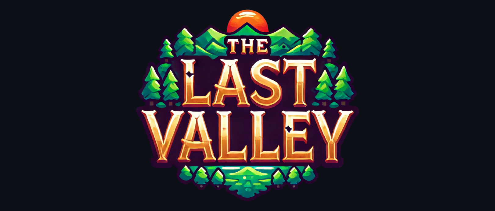
## Takım İsmi
Unity 16
### Takım Üyeleri
| Ad - Soyad    | Görev           |  |
| ------------- |:-------------:| -----:|
| Cumali Onur Gökçe     | Developer |   |
| Deniz Olcaycan   | Product Owner |    |
| Dinçer Can Elitok    | Developer      |    |
| Elif Feyza Güneş | Scrum Master      |    |
| Ertuğrul Küçükel | Developer     |    |

## Oyun Açıklaması
Oyunumuz, oyuncuların karanlık bir krallıkta Kara Şövalye'nin lanetini bozmak için birlikte çalıştıkları bir 3D, co-op, RPG, aksiyon oyunudur. Oyuncular, farklı sınıflardan (savaşçı, okçu, büyücü) oluşan kahramanları kontrol eder ve çeşitli görevleri tamamlayarak krallığı eski ihtişamına kavuşturmaya çalışırlar. Oyuncular, lanetli bölgelerdeki yaratıkları temizleyerek, büyülü nesneleri toplayarak ve görevleri tamamlayarak güç kazanırlar. Oyuncular güvenli alanlarda can ve envanter yenileyebilir, NPC’lerden ipuçları alabilir ve co-op oynanış sayesinde görev paylaşımı yaparak düşmanları yenebilir.
## Oyun Özellikleri
* 3D
* Multiplayer
* Aksiyon
* RPG
* Low Poly
* Third Person
## Hedef Kitle
* Co-op oyunlara ilgi duyanlar
* RPG ve aksiyon oyunu meraklıları
* Fantazi türü sevenler
  
## Product Backlog URL

  
Backlog

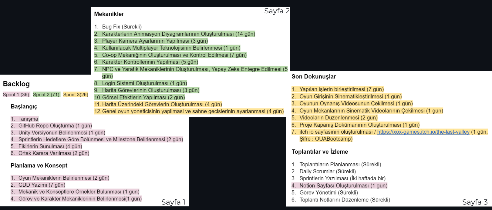

---
# Sprint 1
* Geliştirici ekip olarak, projenin bütün temel ihtiyaçlarını karşılayabileceğimizi test ettik ve projenin bir sonuca ulaşabileceğine emin olduk.
* **Sprint Notları:** Proje yönetimi, toplantı notları ve önemli tarihlerin hatırlatılması için notion; fikir geliştirme, daily scrum, genel konuşmalar ve toplantılar için discord kullanılmasına karar verilmiştir.

  
Sprint Board

  
  ### Sprint Board

* Sprint içinde tamamlanması beklenen puan 36 olarak belirlenmiştir.
  
* **Puan Tamamlama Mantığı:** Puanlama sistemimiz, her görevin tamamlanması için öngörülen gün sayısına eşit puan verilerek belirlenmiştir; böylece `1 gün = 1 puan` olarak hesaplanır. Proje boyunca tamamlanması gereken backlog puanı 133 olarak belirlenmiştir. İlk sprint için 36 puan tamamlanarak hedefe ulaşılmıştır.
  
* **Daily Scrum:** İletişimi sağladığımız discord kanalımızda daily scrum adına açılan oda üzerinde görüşmeler sağlanmıştır.

  
Daily Scrum, Toplantı ve Fikir Geliştirme Ekran Görüntüleri

  
  ### Daily Scrum

  ### Toplantı
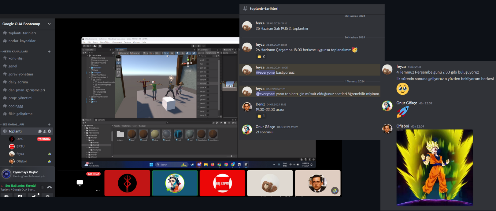

  ### Fikir Geliştirme

  
Ürün Durumu

  
  ### Karakterler

   ### Yapılar

  ### Harita Taslağı 

### Sprint Review

- Takım içi roller kararlaştırıldı, görev dağılımı yapıldı.
- Sprintler hedeflere göre bölündü ve milestonelar belirlendi.
- Oyun fikirleri sunuldu, ortak bir karara varıldı ve oyunun sanat stili belirlendi.
- Oyunun genel mekanikleri belirlendi ve oluşturuldu.
- Oyun hikayesi ve oyun akışı belirlendi.
- Game design document yazıldı.
- Co-op mekaniği oluşturuldu ve kontrol edildi.
- Oyunun sanat stiline uygun temel assetler oluşturuldu.
- Oynanabilen karakter modelleme, texture oluşturma, animasyon ve animasyon diyagramı oluşturma işleri tamamlandı.
- Çift aşamalı görev kontrol sistemi oluşturuldu.
- Düzenli toplantılar planlandı, yapıldı ve toplantı notları tutularak Notion’a yüklendi.

### Sprint Retrospective

- Görev dağılımını oldukça iyi yaptık ve herkes aldığı görevi profesyonel bir yaklaşımla yerine getirdi.
- Kararları ortak ve hızlı bir şekilde alabildik; grup içi uyumumuz çok iyiydi.
- Grup içi iletişimimiz, toplantılarımız ve daily scrumlarımız aktif ve verimli geçti.
- Yapılan işleri çift aşamalı bir kontrolden geçirmemiz sayesinde bir işin düzgün olmama veya zaman kaybetme riskini en aza indirdik
- Görev dağılımında eksik görevleri belirleyip uygun bir şekilde dağıtacağız.
- Olası problemler için görevlere ekstra zaman vererek süreci daha doğru planlayacağız.
- Zaman odaklı bir planlama yapmak ve sprint hedeflerine ulaşmak için gereken adımları atacağız
---
# Sprint 2

* Geliştirici ekip olarak, belirlenen oyun mekaniklerini ve karakter modellerini başarıyla entegre ettik, harita ve çevre tasarımlarının bir kısmını tamamlayarak oyunun temel oynanışını test edilebilir hale getirdik.

  
Sprint Board

  

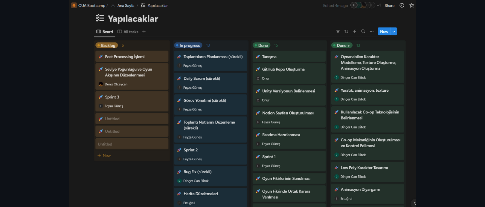

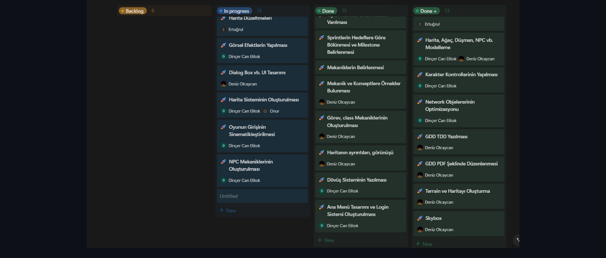

* Sprint içinde tamamlanması beklenen puan 71 olarak belirlenmiştir.
  
* **Puan Tamamlama Mantığı:** İlk sprintle aynı olarak; puanlama sistemimiz, her görevin tamamlanması için öngörülen gün sayısına eşit puan verilerek belirlenmiştir; böylece `1 gün = 1 puan` olarak hesaplanır. Proje boyunca tamamlanması gereken backlog puanı 133 olarak belirlenmiştir. İkinci sprint için 71 puan tamamlanarak hedefe ulaşılmıştır.
  
* **Daily Scrum:** İletişimi sağladığımız discord kanalımızda daily scrum adına açılan oda üzerinde görüşmeler sağlanmıştır.

  
Daily Scrum, Toplantı

  
  ### Daily Scrum
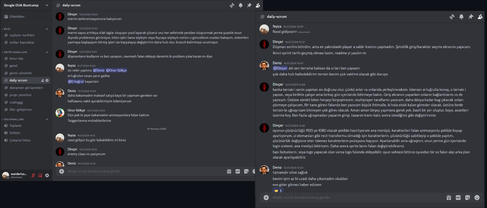

  ### Toplantı
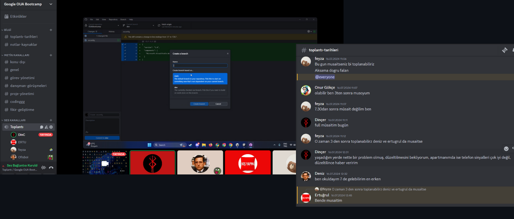

  
Ürün Durumu

  
  ### Ev, Ağaç Örnekleri
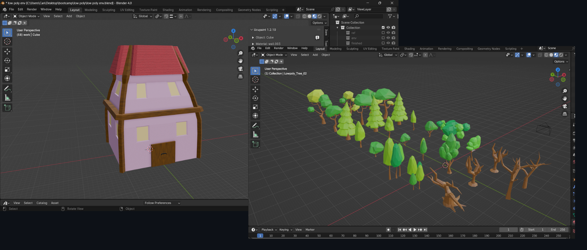

  ### Magical Stone Golem

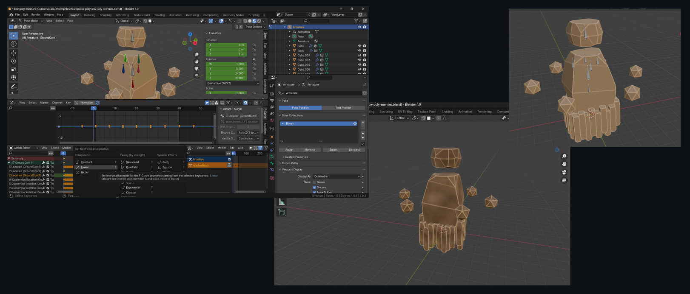

  ### Karakterler

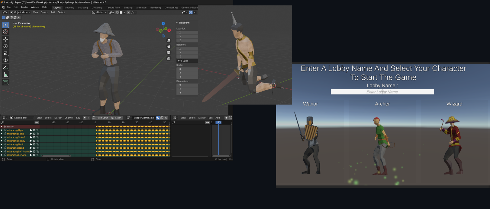

### Sprint Review

- Önceki sprint döneminden kalan, istediğimiz gibi olmadığını fark ettiğimiz görevler belirlendi ve yeniden yapılması için zaman planlaması yapıldı.
- Yeni co-op teknolojileri araştırıldı ve mekanikleri oluşturuldu.
- Animasyon diyagramları karakterlere uyarlandı.
- Köylü karakterlerin modellemesi ve ok fırlatma mekanikleri tamamlandı.
- Magical stone golem modeli oluşturuldu.
- Düşman kodları yazıldı ve NavMesh eklendi.
- Enemy class yazıldı ve düzenlendi.
- Terrain oluşturuldu ve harita başlangıcı yapıldı.
- Harita sisteminin bir kısmı oluşturuldu.
- Giriş ekranı ve ana menü hazırlandı.
- Karakter controllerları tamamlandı ve multiplayer uyumu sağlandı.
- Zaman tasarruf sağlamak amacı ile düşman saldırıları basitleştirildi ve her düşmana uygulanabilir hale getirildi.

### Sprint Retrospective

- Görev dağılımında eksik görevler belirlendi ve tamamlamak için tarih belirlendi. 
- Yapılan işleri çift aşamalı bir kontrolden geçirmemiz sayesinde bir işin düzgün olmama veya zaman kaybetme riskini en aza indirmeye devam ettik.
- Grup içi iletişimimizi ve daily scrumlarımızı daha aktif tutmaya çalıştık.
- Zaman odaklı planlama yapmaya devam ettik
- Süre yetmeyeceği için oyundan bazı unsurları kaldırma konusunda hemfikir olduk.

---
# Sprint 3

* Geliştirici ekip olarak, tüm oyun mekaniklerini, karakterleri ve seviyeleri başarıyla birleştirerek oyunu tamamladık, oyun videosunu çekip editledik ve projenin planlandığı gibi çalıştığından emin olduk.

  
Sprint Board

  

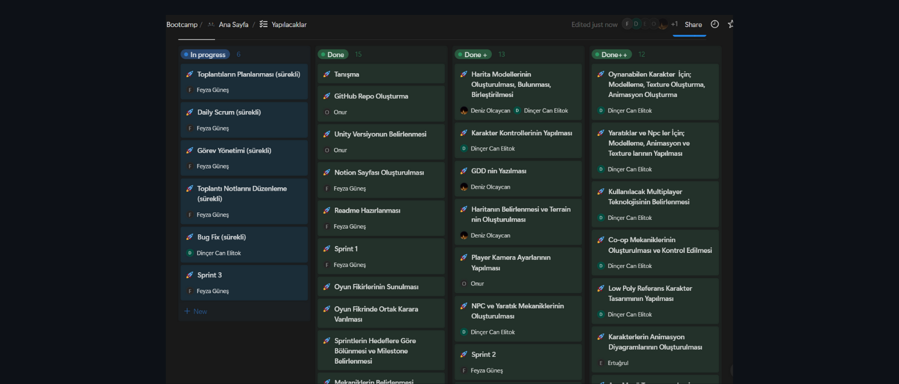

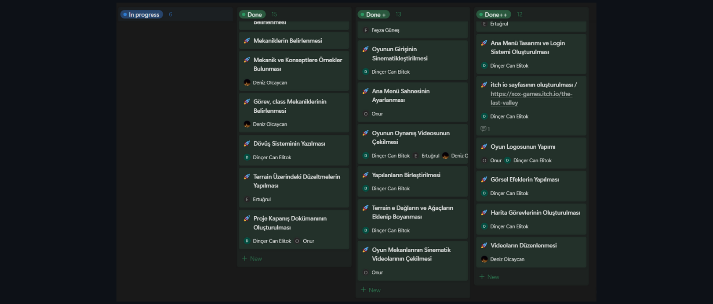

* Sprint içinde tamamlanması beklenen puan 26 olarak belirlenmiştir.
  
* **Puan Tamamlama Mantığı:** İlk sprintle aynı olarak; puanlama sistemimiz, her görevin tamamlanması için öngörülen gün sayısına eşit puan verilerek belirlenmiştir; böylece `1 gün = 1 puan` olarak hesaplanır. Proje boyunca tamamlanması gereken backlog puanı 133 olarak belirlenmiştir. İkinci sprint için 26 puan tamamlanarak hedefe ulaşılmıştır.
  
* **Daily Scrum:** İletişimi sağladığımız discord kanalımızda daily scrum adına açılan oda üzerinde görüşmeler sağlanmıştır.

  
Daily Scrum, Toplantı

  
  ### Daily Scrum

  ### Toplantı

  
Ürün Durumu

  
  ### Ev, Ağaç Örnekleri

  ### Magical Stone Golem

  ### Karakterler

### Sprint Review

- Önc

### Sprint Retrospective

- Gör

